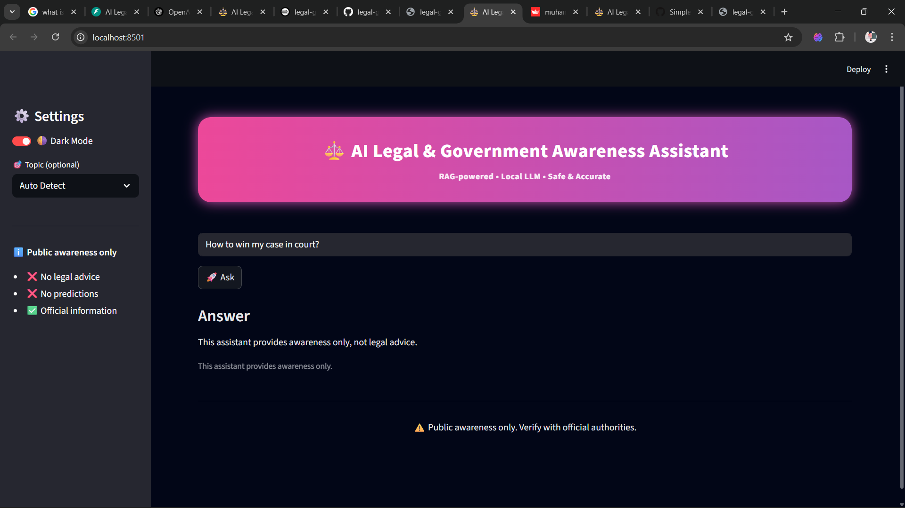

# ⚖️ AI Legal & Government Awareness Assistant (GenAI + RAG)

A **topic-aware GenAI system** that provides **accurate, hallucination-free legal and government information** using **Retrieval-Augmented Generation (RAG)** and a **local Large Language Model (LLM)**.

The system is designed with **strict topic isolation**, **safety constraints**, and **production-style architecture** to ensure reliable public awareness responses.

> ⚠️ This project is for **public information only**. It does **not provide legal advice**.

---
## 🌐 Live Demo

- **Frontend (Streamlit UI):**  
  👉 https://<YOUR-STREAMLIT-APP-URL>

- **Backend (FastAPI – Railway):**  
  👉 https://<YOUR-RAILWAY-BACKEND-URL>/docs

---

## 🖼️ Screenshots

### Home Interface


### Example: Aadhaar Query


### Safety Handling (Out-of-Scope Query)


## 🎯 Key Capabilities

- Topic-aware **RAG pipeline** (prevents cross-topic hallucination)
- Metadata-filtered **FAISS vector search**
- **Local LLM (Ollama – Llama3)** → no paid APIs
- Strict **safety & disclaimer enforcement**
- Modern, animated **Streamlit UI**
- Dark / Light mode with chat history
- Clean separation of **UI and AI logic**

---

## 🏛 Supported Domains

### Government
- Aadhaar
- PAN Card
- Voter ID

### Legal
- FIR / Police Procedure
- Consumer Rights
- Tenant Rights

Out-of-scope queries are **safely declined**.

---

## 🏗 System Architecture

Streamlit UI
│
▼
FastAPI Backend (/ask)
│
▼
Topic Detection
│
▼
FAISS Vector Search (metadata-filtered, k=1)
│
▼
Context Injection
│
▼
Local LLM (Ollama – Llama3)


---

## 🛠 Technology Stack

| Layer | Tools |
|-----|------|
| Frontend | Streamlit |
| Backend | FastAPI |
| LLM | Ollama (Llama3) |
| RAG | LangChain |
| Vector Store | FAISS |
| Embeddings | Sentence Transformers |
| Language | Python |

---

## 🧠 Engineering Highlights

- Enforced **single-topic retrieval (k=1)** to eliminate answer mixing
- Applied **metadata-based filtering** for document isolation
- Added **prompt-level constraints** to prevent unsafe responses
- Fully decoupled UI from backend to avoid regression during UI changes
- Designed for **local execution** without dependency on paid APIs

---
## 🔍 Cloud vs Local Execution

This project is intentionally designed with **environment-aware execution**.

### 🖥 Local Mode (Full Capability)
When running locally:
- Retrieval-Augmented Generation (RAG) is enabled
- FAISS vector search loads government & legal documents
- A local LLM (Ollama – Llama3) generates grounded responses
- Used for development, testing, and full demonstrations

### ☁️ Cloud Mode (Safe Awareness Mode)
When deployed to the cloud:
- The backend runs in **cloud-safe mode**
- Heavy ML components (FAISS, embeddings, Ollama) are disabled
- The system returns **verified fallback responses** when no official context is available

### ❓ Why this design?
- Local LLMs (Ollama) cannot run on typical free cloud platforms
- Running embeddings and vector stores in the cloud would require paid GPU services
- To prevent hallucinations, the system is designed to **fail safely rather than fabricate answers**

### ✅ Result
- No false or misleading information
- No hallucinated legal advice
- Clear separation of concerns
- Production-style architecture with safety guarantees

This approach reflects real-world engineering tradeoffs between
**cost, reliability, and correctness**.

## ▶️ Local Setup

### Install Dependencies
```bash
pip install -r requirements.txt

Start LLM
ollama pull llama3

Run Backend
uvicorn app.main:app --reload

Run Frontend
streamlit run frontend/streamlit_app.py

🧪 Example Queries

How to apply for Aadhaar?

What is the FIR filing procedure?

What are tenant rights?

What are consumer rights?

🔐 Safety Considerations

No legal advice or case predictions

No personal data handling

Explicit disclaimers on every response

Designed strictly for public awareness

🚀 Deployment Notes

Optimized for local deployment (interviews, demos)

Backend: FastAPI + Uvicorn

Frontend: Streamlit

Ollama is intended for local execution.
Cloud deployment requires a hosted LLM replacement.

👤 Author

Muhammed Ansil
B.Tech – Artificial Intelligence & Data Science
Interests: GenAI, RAG Systems, AI Engineering

⭐ Acknowledgement

If this project is useful, feel free to ⭐ the repository.

